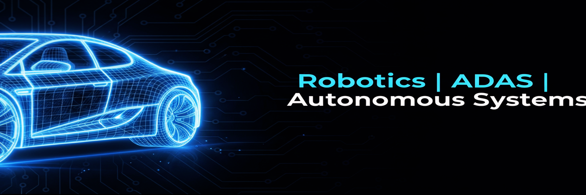
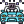

<!-- Badges (Visitors + WakaTime) -->

  
  

 

<!-- Banner -->

  

<!-- Intro  -->
<h3 align="center">
        <samp>&gt; Hey There 👋 , I am
                <b><a target="_blank" href="https://pavanmp140102.github.io/Me/">Pavan Patil</a></b>
        </samp>
</h3>

 
  <samp>
     
    「<b> 
       Robotics | 
       Autonomous Systems | 
       ADAS Enthusiast  」
     </b>
     
  </samp>

 

 
 

 

 

<!-- About Section -->
<h2 align="left">
  <samp> &gt; <b>About Me</b></samp>
</h2>

<samp>
• 🔭 Preparing for a career in <b><i>Autonomous Driving & ADAS Development</i></b> 
• 🌱 Actively learning and applying <b><i>ROS2, Computer Vision, and ADAS Technologies</i></b> in practical projects 
• 🤝 Open to collaboration in <b><i>Robotics & AI/ML projects</i></b> 
• 📂 Explore my projects here 👉 <a href="https://github.com/pavanmp140102?tab=repositories">My Repositories</a> 
• 📫 Reach me at <a href="mailto:pavanmp72826@gmail.com">pavanmp72826@gmail.com</a> 
</samp>

<!-- Skills Section -->
 
<h2 align="left">
  <samp> &gt; <b>Skills</b></samp>
</h2>

### 👨‍💻 Programming & Development
 &nbsp;
 &nbsp;
 &nbsp;
 &nbsp;
 &nbsp;
 &nbsp;
 &nbsp;
 &nbsp;

---

### 🤖 Robotics & Autonomous Systems
 &nbsp;
 &nbsp;
 &nbsp;
 &nbsp;
 &nbsp;
 &nbsp;
 &nbsp;
---

### 🔌 Embedded & Hardware
&nbsp;

 &nbsp;
 &nbsp;
 &nbsp;
 &nbsp;

---

### 🛠️ Tools & Design
 &nbsp;
 &nbsp;
 &nbsp;
 &nbsp;
 &nbsp;
 &nbsp;

<!-- GitHub Stats Section -->
<h2 align="left">
  <samp> &gt; <b>GitHub Stats</b></samp>
</h2>

<!-- GitHub Streak -->

  

<!-- Profile Summary Cards -->

  
  
  

